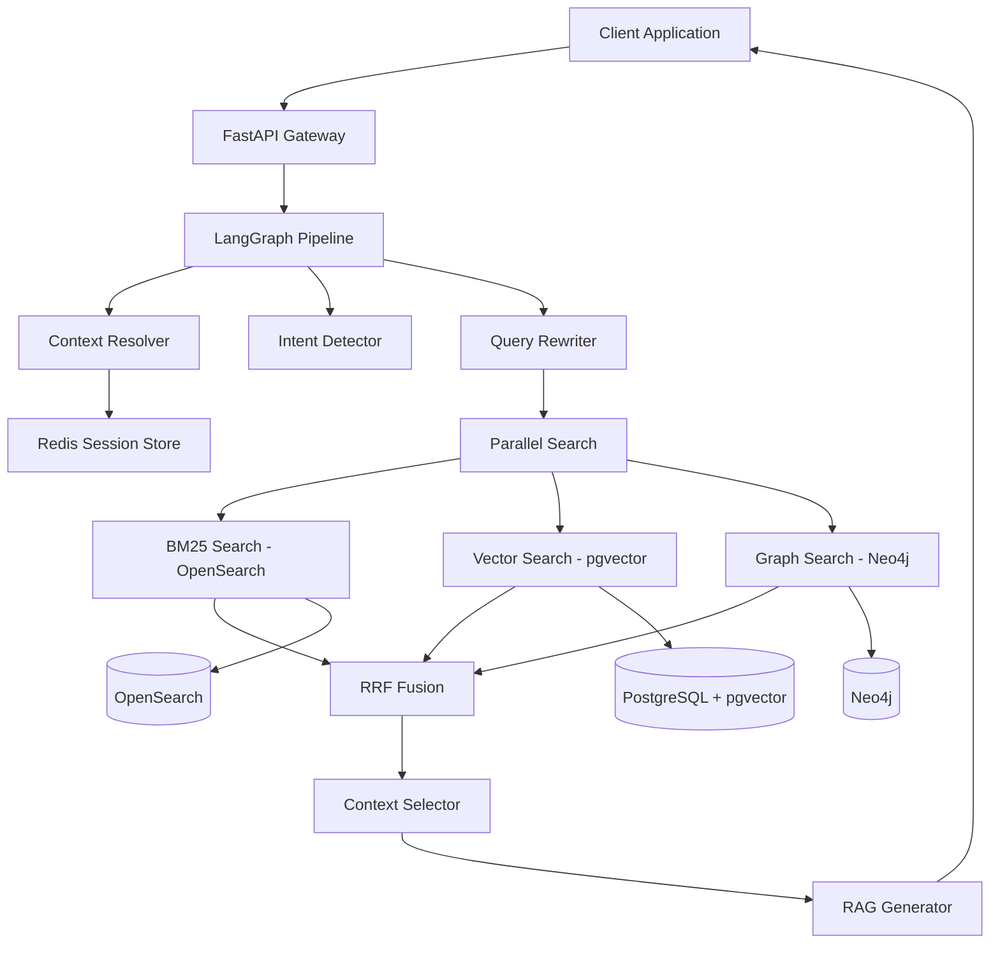
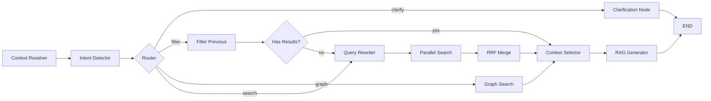

# Hybrid Search v2 - Technical Architecture Documentation

## Executive Summary

Hybrid Search v2 is a conversational search and RAG (Retrieval-Augmented Generation) system designed for catering menus. It combines multiple search methodologies (BM25, vector similarity, and graph traversal) with intelligent intent detection to provide accurate, context-aware search results.

**Key Architectural Principles:**
- **Multi-engine search**: Parallel execution of BM25 (lexical) and vector (semantic) search
- **RRF fusion**: Reciprocal Rank Fusion for intelligent result merging
- **Conversational context**: Session-aware search with follow-up handling
- **Extensibility**: Pluggable search engines (Neo4j graph search ready)
- **Observability**: Comprehensive metrics, tracing, and monitoring
- **Multi-tenancy**: Row-Level Security (RLS) for tenant isolation

---

## System Architecture

### High-Level Component Diagram



### Infrastructure Stack

| Component | Technology | Port | Purpose |
|-----------|-----------|------|---------|
| **API Server** | FastAPI (Python 3.12+) | 8000 | REST API & WebSocket |
| **Lexical Search** | OpenSearch | 9200 | BM25 keyword search |
| **Vector Search** | PostgreSQL + pgvector | 5433 | Semantic similarity |
| **Session Store** | Redis | 6379 | Conversation context |
| **Graph Database** | Neo4j | 7474/7687 | Relationship queries |
| **Embeddings** | OpenAI API | - | text-embedding-3-small |
| **LLM** | OpenAI API | - | GPT-4 Turbo |

---

## Core Search Architecture

### 1. Search Engine Components

#### BM25 Search (OpenSearch)

**Purpose**: Lexical/keyword-based search for exact term matching.

**Implementation**: `src/search/bm25.py::BM25Searcher`

```python
class BM25Searcher:
    def search(
        self,
        query: str,
        filters: SearchFilters,
        top_k: int = 50,
    ) -> list[dict[str, Any]]
```

**Key Features:**
- Multi-field search with boosting: `item_name^3`, `item_description^2`, `text`, `restaurant_name`
- Fuzzy matching with `AUTO` fuzziness
- Filter pushdown for structured filtering (city, price, dietary, etc.)
- Synchronous execution (wrapped in asyncio for parallel execution)

**OpenSearch Mapping:**
- Text fields use standard analyzer
- Keyword fields for exact matching
- Numeric fields for range filters

#### Vector Search (pgvector)

**Purpose**: Semantic similarity search using dense embeddings.

**Implementation**: `src/search/vector.py::VectorSearcher`

```python
class VectorSearcher:
    async def search(
        self,
        query: str,
        filters: SearchFilters,
        top_k: int = 50,
    ) -> list[dict[str, Any]]
```

**Key Features:**
- OpenAI `text-embedding-3-small` (1536 dimensions)
- Cosine similarity via `<=>` operator
- Pre-filtering with SQL WHERE clauses
- Async execution with connection pooling (asyncpg)

**Database Schema:**
```sql
CREATE TABLE menu_embeddings (
    doc_id UUID PRIMARY KEY,
    embedding vector(1536),
    restaurant_id UUID,
    city TEXT,
    base_price NUMERIC,
    serves_max INTEGER,
    dietary_labels TEXT[],
    -- ... other fields
);

CREATE INDEX idx_menu_embeddings_vector 
ON menu_embeddings USING ivfflat (embedding vector_cosine_ops);
```

#### Graph Search (Neo4j) - Phase 2

**Purpose**: Relationship-based queries (same restaurant, similar items, pairings).

**Implementation**: `src/search/graph.py::GraphSearcher`

**Query Types:**
1. **restaurant_items**: "Show me more from this restaurant"
2. **similar_restaurants**: "Similar restaurants nearby"
3. **pairing**: "What pairs well with this?"
4. **catering_packages**: "Complete catering for 50 people"

**Feature Flags:**
- `enable_graph_search`: Disable/enable graph search
- `enable_3way_rrf`: Enable 3-way RRF fusion

---

### 2. RRF Fusion (Reciprocal Rank Fusion)

**Purpose**: Merge results from multiple search engines into a unified ranking.

**Implementation**: `src/search/rrf_utils.py`

**Algorithm:**
```
RRF(d) = Σ (weight_i / (k + rank_i(d)))
```

Where:
- `k = 60` (default RRF constant)
- `weight_i` = importance of search engine i
- `rank_i(d)` = rank of document d in result list i

**2-Way Merge (BM25 + Vector):**
```python
merged = rrf_merge_2way(
    bm25_results,
    vector_results,
    k=60,
    bm25_weight=1.0,
    vector_weight=1.0,
)
```

**3-Way Merge (BM25 + Vector + Graph):**
```python
merged = rrf_merge_3way(
    bm25_results,
    vector_results,
    graph_results,
    k=60,
    bm25_weight=1.0,
    vector_weight=1.0,
    graph_weight=1.0,
)
```

**Result Enrichment:**
- Vector-only results are enriched with full document data from OpenSearch
- Each result tagged with source indicators: `in_bm25`, `in_vector`, `in_graph`

---

### 3. LangGraph Pipeline

**Purpose**: Orchestrates the conversational search workflow with state management.

**Implementation**: `src/langgraph/graph.py`

#### Pipeline Flow



#### Node Descriptions

| Node | Function | Implementation |
|------|----------|----------------|
| **Context Resolver** | Load session from Redis | `context_resolver_node` |
| **Intent Detector** | Classify intent (search/filter/clarify/compare) | `intent_detector_node` |
| **Query Rewriter** | Extract entities, expand query | `query_rewriter_node` |
| **Parallel Search** | Execute BM25 + Vector concurrently | `parallel_search_node` |
| **Graph Search** | Execute Neo4j queries | `graph_search_node` |
| **RRF Merge** | Fuse results with RRF | `rrf_merge_node` / `rrf_merge_3way_node` |
| **Context Selector** | Apply diversity rules | `context_selector_node` |
| **RAG Generator** | Generate natural language response | `rag_generator_node` |
| **Filter Previous** | Filter cached results for follow-ups | `filter_previous_node` |
| **Clarification** | Generate clarification questions | `clarification_node` |

#### State Management

**GraphState** (`src/models/state.py`):
```python
class GraphState(TypedDict):
    # Session
    session_id: str
    user_input: str
    timestamp: str
    
    # Intent
    intent: IntentType  # search | filter | clarify | compare
    is_follow_up: bool
    follow_up_type: FollowUpType | None  # price | serving | dietary | location | scope
    confidence: float
    
    # Query
    resolved_query: str
    filters: SearchFilters
    expanded_query: str
    
    # Graph search
    requires_graph: bool
    graph_query_type: GraphQueryType | None
    reference_doc_id: str | None
    reference_restaurant_id: str | None
    
    # Retrieval
    candidate_doc_ids: list[str]
    bm25_results: list[dict]
    vector_results: list[dict]
    graph_results: list[dict]
    
    # Fusion
    merged_results: list[dict]
    final_context: list[dict]
    
    # Output
    answer: str
    sources: list[str]
    
    # Error
    error: str | None
```

---

### 4. Intent Detection & Query Understanding

**Implementation**: `src/langgraph/nodes.py::intent_detector_node`

**LLM-Powered Classification:**
```python
INTENT_DETECTION_PROMPT = """
Classify the user's intent:
- search: New search query
- filter: Refining previous results (e.g., "cheaper ones")
- clarify: Asking questions (e.g., "What do you recommend?")
- compare: Comparing options

Previous query: {previous_query}
Previous entities: {entities}
Has previous results: {has_results}
User input: {user_input}
"""
```

**Follow-up Detection:**
| Type | Example | Behavior |
|------|---------|----------|
| **price** | "Cheaper ones under $15" | Filter by `price_max` |
| **serving** | "Options for 50 people" | Filter by `serves_min` |
| **dietary** | "Vegetarian options" | Filter by `dietary_labels` |
| **location** | "In Boston" | Update `city` filter, re-search |
| **scope** | "More from this restaurant" | Set `restaurant_id`, filter or graph search |

**Graph Query Detection:**
```python
GRAPH_QUERY_PATTERNS = {
    "restaurant_items": [
        r"more from (this|the same) restaurant",
        r"other items? from",
        r"show me (their|the) (full )?menu",
    ],
    "similar_restaurants": [
        r"similar restaurants?",
        r"restaurants? like (this|these)",
    ],
    "pairing": [
        r"(what |something to )?pairs? (well )?with",
        r"side(s)? (for|to go with)",
    ],
}
```

---

### 5. Entity Extraction & Query Expansion

**Implementation**: `src/langgraph/nodes.py::query_rewriter_node`

**Entity Extraction:**
```python
class EntityExtractionResult(BaseModel):
    city: str | None
    state: str | None
    cuisine: list[str] | None
    dietary_labels: list[str] | None
    price_max: float | None
    price_per_person_max: float | None
    serves_min: int | None
    serves_max: int | None
    restaurant_name: str | None
    tags: list[str] | None
    item_keywords: list[str] | None
    menu_type: str | None
    price_adjustment: str | None  # "increase" | "decrease"
    serving_adjustment: str | None  # "increase" | "decrease"
    scope_same_restaurant: bool | None
    scope_other_restaurants: bool | None
```

**Query Expansion:**
```python
QUERY_EXPANSION_PROMPT = """
Expand the query with synonyms and related terms for better BM25 matching.

Original: {user_input}
Entities: {entities}

Expanded query:
"""
```

**Follow-up Adjustment Rules:**
- **Price decrease**: `price_max = min(previous_prices) * 0.9`
- **Serving increase**: `serves_min = previous_serves_max`
- **Same restaurant**: Set `restaurant_id` from previous result
- **Other restaurants**: Set `exclude_restaurant_id`

---

### 6. Context Selection & Diversity

**Implementation**: `src/langgraph/nodes.py::context_selector_node`

**Selection Strategy:**
```python
max_items = 8  # settings.max_context_items
max_per_restaurant = 3  # settings.max_per_restaurant
max_tokens = 4000  # settings.max_context_tokens
token_buffer = 500  # Reserve for prompt/response
```

**Algorithm:**
1. Iterate through merged results (sorted by RRF score)
2. Skip if restaurant already has `max_per_restaurant` items
3. Estimate token count for each document
4. Stop when token budget reached (`max_tokens - token_buffer`)
5. Track selected document IDs for session state

**Token Estimation:**
```python
def _estimate_tokens(text: str) -> int:
    # ~4 chars per token + 10% buffer
    return math.ceil(len(text) / 4 * 1.1)
```

---

### 7. RAG Generation

**Implementation**: `src/langgraph/nodes.py::rag_generator_node`

**Prompt Template:**
```python
RAG_GENERATION_PROMPT = """
You are a catering menu assistant. Answer based on the provided context.

Question: {question}
Location: {city}
Cuisine: {cuisine}
Dietary: {dietary}
Budget: {price_max}
Party Size: {serves_min}

Context:
{context}

Answer naturally, citing specific menu items and restaurants.
"""
```

**LLM Configuration:**
- Model: `gpt-4-turbo-preview`
- Temperature: 0 (deterministic for factual accuracy)
- Circuit breaker: Prevents cascading failures

---

## Session Management

### Redis Session Store

**Implementation**: `src/session/manager.py::SessionManager`

**Session State:**
```python
class SessionState(BaseModel):
    session_id: str
    created_at: datetime
    last_activity: datetime
    ttl_seconds: int = 86400  # 24 hours
    
    entities: SessionEntities  # Tracked filters
    conversation: list[ConversationTurn]  # Chat history
    previous_results: list[str]  # Doc IDs
    previous_query: str | None
    preferences: SessionPreferences
```

**Key Operations:**
- `get_or_create_session(session_id)`: Lazy session creation
- `save_session(session)`: TTL-based expiration
- `get_session_context(session_id)`: Extract context for pipeline
- `add_user_turn(content)`: Append user message
- `add_assistant_turn(content, result_ids)`: Append response with citations

**Redis Key Format:**
```
session:{session_id}
```

**Metrics:**
- Active sessions counter (incremented on create, decremented on delete)
- Session TTL: 24 hours (configurable via `session_ttl_seconds`)

---

## Configuration & Settings

### Environment Variables

**Core Settings** (`src/config/settings.py`):

```python
# OpenAI
OPENAI_API_KEY=sk-...
OPENAI_MODEL=gpt-4-turbo-preview
OPENAI_EMBEDDING_MODEL=text-embedding-3-small
EMBEDDING_DIMENSIONS=1536

# OpenSearch
OPENSEARCH_HOST=localhost
OPENSEARCH_PORT=9200
OPENSEARCH_USER=admin
OPENSEARCH_PASSWORD=admin
OPENSEARCH_INDEX=catering_menus

# PostgreSQL/pgvector
POSTGRES_HOST=localhost
POSTGRES_PORT=5433
POSTGRES_USER=postgres
POSTGRES_PASSWORD=postgres
POSTGRES_DB=hybrid_search

# Redis
REDIS_HOST=localhost
REDIS_PORT=6379
REDIS_PASSWORD=
REDIS_DB=0
SESSION_TTL_SECONDS=86400

# Neo4j
NEO4J_URI=bolt://localhost:7687
NEO4J_USER=neo4j
NEO4J_PASSWORD=password

# Search Parameters
BM25_TOP_K=50
VECTOR_TOP_K=50
RRF_K=60
BM25_WEIGHT=1.0
VECTOR_WEIGHT=1.0
MAX_CONTEXT_ITEMS=8
MAX_PER_RESTAURANT=3
MAX_CONTEXT_TOKENS=4000

# Feature Flags
ENABLE_GRAPH_SEARCH=false
ENABLE_3WAY_RRF=false
```

---

## API Endpoints

### Chat Search

**Endpoint**: `POST /chat/search`

**Request:**
```json
{
  "session_id": "user-123-session",
  "user_input": "Italian catering in Boston for 20 people under $200",
  "max_results": 10
}
```

**Response:**
```json
{
  "session_id": "user-123-session",
  "resolved_query": "Italian catering in Boston for 20 people under $200",
  "intent": "search",
  "is_follow_up": false,
  "filters": {
    "city": "Boston",
    "cuisine": ["Italian"],
    "serves_min": 20,
    "price_max": 200
  },
  "results": [
    {
      "doc_id": "uuid-here",
      "restaurant_name": "Bella Italia",
      "city": "Boston",
      "state": "MA",
      "item_name": "Pasta Platter",
      "item_description": "Assorted pasta...",
      "display_price": 150.00,
      "price_per_person": 7.50,
      "serves_min": 15,
      "serves_max": 25,
      "dietary_labels": ["vegetarian"],
      "tags": ["pasta", "italian"],
      "rrf_score": 0.032
    }
  ],
  "answer": "I found several Italian catering options in Boston...",
  "confidence": 0.95,
  "processing_time_ms": 245.32
}
```

### Session Management

**Get Session**: `GET /session/{session_id}`

**Delete Session**: `DELETE /session/{session_id}`

**Submit Feedback**: `POST /session/{session_id}/feedback`
```json
{
  "doc_id": "uuid-here",
  "rating": 5
}
```

---

## Monitoring & Observability

### Metrics Collection

**Implementation**: `src/metrics.py`

**Tracked Metrics:**
- `search_requests_total{engine, status}`: Counter of search requests
- `search_duration_seconds{engine}`: Histogram of search latency
- `active_sessions`: Gauge of concurrent sessions
- `llm_calls_total{model, operation, status}`: LLM call counter
- `llm_call_duration_seconds{model, operation}`: LLM latency
- `llm_tokens_total{model, type}`: Token usage (prompt/completion)
- `user_feedback_total{result_type, rating}`: User feedback counter
- `database_query_duration_seconds{database, query_type, table}`: Query performance

### System Monitoring

**Components:**
- `src/monitoring/system_metrics.py`: CPU, memory, disk I/O
- `src/monitoring/database_monitor.py`: Connection pool stats, query performance
- `src/monitoring/middleware.py`: Request/response metrics, error tracking

### Distributed Tracing

**Implementation**: `src/monitoring/tracing.py`

**Configuration:**
```python
OTEL_TRACING_ENABLED=true
OTEL_SERVICE_NAME=hybrid-search-v2
OTEL_EXPORTER_OTLP_ENDPOINT=http://localhost:4318
```

**Instrumented Libraries:**
- FastAPI (HTTP server)
- OpenSearch (search client)
- asyncpg (database driver)
- Redis (session store)
- Neo4j (graph database)
- OpenAI (LLM client)

---

## Performance Optimization

### Parallel Execution

**BM25 + Vector Parallelism:**
```python
bm25_task = asyncio.create_task(
    asyncio.to_thread(bm25_searcher.search, query, filters, top_k)
)
vector_task = asyncio.create_task(
    vector_searcher.search(query, filters, top_k)
)
bm25_results, vector_results = await asyncio.gather(bm25_task, vector_task)
```

### Connection Pooling

**PostgreSQL (asyncpg):**
```python
pool = await asyncpg.create_pool(
    dsn,
    min_size=2,
    max_size=10,
)
```

**Neo4j:**
```python
driver = AsyncGraphDatabase.driver(
    uri,
    auth=(user, password),
    max_connection_pool_size=50,
)
```

### Caching Strategy

**Session Cache**: Redis with TTL (24 hours)
**Result Cache**: Previous results stored in session for follow-up filtering

### Query Optimization

**BM25:**
- Field boosting (`item_name^3`)
- Fuzzy matching for typo tolerance
- Filter pushdown to reduce candidate set

**Vector:**
- IVFFlat index for approximate nearest neighbor search
- Pre-filtering with SQL WHERE clauses
- Cosine similarity optimized via pgvector

---

## Security & Multi-Tenancy

### Row-Level Security (RLS)

**Implementation**: All database queries include tenant filtering via `restaurant_id`

**Middleware**: `src/middleware/tenant_context.py`
```python
class TenantContextMiddleware:
    async def __call__(self, scope, receive, send):
        # Extract tenant from JWT or header
        # Set context for RLS
```

### JWT Authentication

**Configuration:**
```python
JWT_SECRET_KEY=<min 32 chars>
JWT_ALGORITHM=HS256
JWT_ACCESS_TOKEN_EXPIRE_HOURS=24
JWT_REFRESH_TOKEN_EXPIRE_DAYS=7
```

**Implementation**: `src/auth/jwt.py`

### Input Validation

- Pydantic models for request/response validation
- SQL parameterization to prevent injection
- LLM output validation with `model_validate()`

---

## Data Pipeline

### Ingestion Pipeline

**Implementation**: `src/ingestion/pipeline.py`

**Steps:**
1. Load JSON data files
2. Generate embeddings via OpenAI
3. Batch insert into OpenSearch
4. Batch insert into PostgreSQL (with vectors)
5. Create graph nodes/relationships in Neo4j

**Script**: `scripts/run_ingestion.py`
```bash
python scripts/run_ingestion.py data/sample/ --skip-embeddings
```

### Embedding Generation

**Implementation**: `src/ingestion/embeddings.py::EmbeddingGenerator`

```python
async def generate_query_embedding(query: str) -> list[float]:
    response = await openai.Embedding.acreate(
        model="text-embedding-3-small",
        input=query,
    )
    return response.data[0].embedding
```

---

## Error Handling & Resilience

### Circuit Breaker

**Implementation**: `src/utils/circuit_breaker.py`

**OpenAI Circuit Breaker:**
- Failure threshold: 5 failures in 60 seconds
- Recovery timeout: 30 seconds
- Fallback: Default intent/entities on failure

### Graceful Degradation

**Scenarios:**
- **OpenSearch down**: Fall back to vector-only search
- **pgvector down**: Fall back to BM25-only search
- **Neo4j down**: Skip graph search, use 2-way RRF
- **OpenAI down**: Use cached embeddings, return raw results

### Error Logging

**Structured Logging**: `structlog`
```python
logger.error(
    "search_error",
    error=str(e),
    session_id=request.session_id,
    duration=duration,
)
```

---

## Testing Strategy

### Test Organization

- `tests/unit/`: Unit tests for individual components
- `tests/integration/`: Integration tests with mocked services
- `tests/e2e/`: End-to-end pipeline tests

### Test Fixtures

```python
@pytest.fixture
def bm25_searcher():
    client = OpenSearch(...)
    return BM25Searcher(client)

@pytest.fixture
async def vector_searcher():
    pool = await asyncpg.create_pool(...)
    return VectorSearcher(pool)
```

### Running Tests

```bash
# Unit tests
pytest tests/unit/

# Integration tests (requires Docker)
pytest tests/integration/

# Coverage
pytest --cov=src --cov-report=html
```

---

## Deployment

### Docker Compose (Development)

**File**: `deployment/docker-compose.yml`

```yaml
services:
  opensearch:
    image: opensearchproject/opensearch:2.11.0
    ports: ["9200:9200"]
  
  postgres:
    image: pgvector/pgvector:pg16
    ports: ["5433:5432"]
  
  redis:
    image: redis:7-alpine
    ports: ["6379:6379"]
  
  neo4j:
    image: neo4j:5.14
    ports: ["7474:7474", "7687:7687"]
```

### Production Considerations

**Scalability:**
- Horizontal scaling of API servers (stateless)
- OpenSearch cluster with multiple nodes
- PostgreSQL read replicas for vector search
- Redis Cluster for session store
- Neo4j causal cluster

**High Availability:**
- Multi-AZ deployment
- Auto-scaling based on CPU/memory metrics
- Health checks with automatic restart

**Security:**
- VPC isolation
- SSL/TLS for all connections
- Secrets management (AWS Secrets Manager)
- WAF for API protection

---

## Future Enhancements

### Phase 2 Roadmap

1. **Advanced Graph Search**
   - Enable `enable_graph_search` flag
   - Implement 3-way RRF fusion
   - Add catering package builder

2. **Query Understanding**
   - Multi-turn query refinement
   - Contextual query expansion
   - Synonym injection from knowledge graph

3. **Personalization**
   - User preference learning
   - Click-through rate optimization
   - Collaborative filtering

4. **Advanced RAG**
   - Multi-stage retrieval
   - Re-ranking with cross-encoders
   - Query rewriting with LLM

5. **Performance**
   - Result caching with Redis
   - Embedding cache for common queries
   - Async streaming responses

6. **Analytics**
   - Search analytics dashboard
   - A/B testing framework
   - Conversion tracking

---

## Developer Guide

### Local Development Setup

```bash
# 1. Clone repository
git clone https://github.com/your-org/hybrid-search-v2
cd hybrid-search-v2

# 2. Start infrastructure
docker-compose -f deployment/docker-compose.yml up -d

# 3. Create virtual environment
python -m venv .venv
source .venv/bin/activate

# 4. Install dependencies
pip install -e ".[dev]"

# 5. Configure environment
cp .env.example .env
# Edit .env with your API keys

# 6. Run ingestion
python scripts/run_ingestion.py data/sample/

# 7. Start API server
uvicorn src.api.main:app --reload

# 8. Run tests
pytest
```

### Code Style

```bash
# Linting
ruff check .

# Formatting
ruff format .

# Type checking
mypy .

# Tests
pytest --cov=src
```

### Debugging

**Enable Debug Logging:**
```bash
export LOG_LEVEL=DEBUG
export DEBUG=true
```

**Inspect Session:**
```bash
curl http://localhost:8000/session/{session_id}
```

**Trace Search Pipeline:**
```python
# Add logging in nodes.py
logger.info("node_name", state=state)
```

---

## Troubleshooting

### Common Issues

**1. No Search Results**
- Check OpenSearch index: `curl localhost:9200/catering_menus/_count`
- Verify embeddings: Check `menu_embeddings` table row count
- Review filters: Ensure filters aren't too restrictive

**2. High Latency**
- Check connection pool saturation
- Review slow query logs in PostgreSQL
- Monitor OpenSearch heap usage
- Check Redis memory usage

**3. Session Loss**
- Verify Redis connectivity
- Check TTL settings
- Review session serialization

**4. LLM Errors**
- Check OpenAI API key validity
- Monitor rate limits
- Review circuit breaker state

---

## References

- **LangGraph Documentation**: https://langchain-ai.github.io/langgraph/
- **OpenSearch BM25**: https://opensearch.org/docs/latest/search-plugins/bm25/
- **pgvector**: https://github.com/pgvector/pgvector
- **Reciprocal Rank Fusion**: https://plg.uwaterloo.ca/~gvcormac/cormacksigir09-rrf.pdf
- **RAG Best Practices**: https://arxiv.org/abs/2312.10997

---

**Document Version**: 1.0  
**Last Updated**: March 2026  
**Maintained By**: Architecture Team
