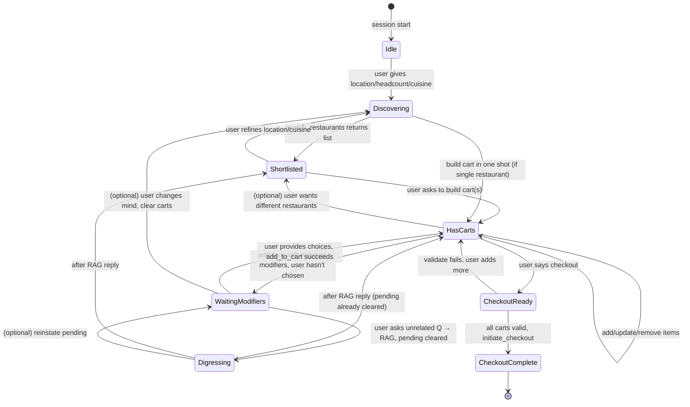
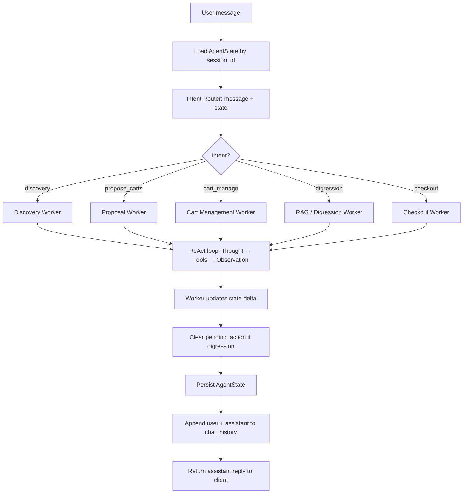
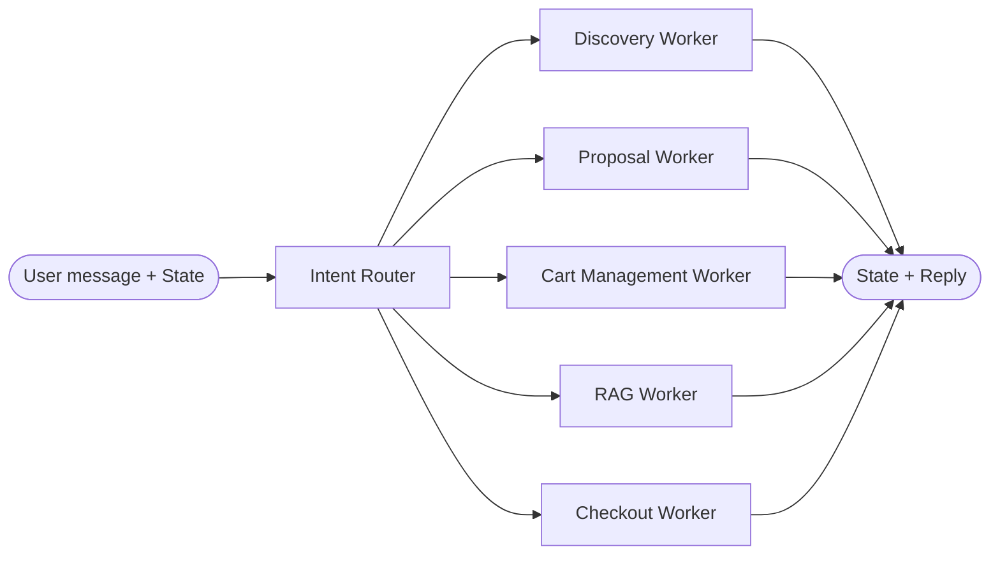

# Catering AI — Architecture & State Diagram

**Purpose:** Design the AI application architecture and state diagram for the catering chatbot (cateringrewards.com), aligned with the dry runs in `sample_ai_chats.md` and `detailed_dry_runs_and_tools.md`.

---

## 1. Review of Current AI Chat Design

From your docs we have:

| Element | Source | Summary |
|--------|--------|--------|
| **AgentState** | sample_ai_chats.md | `user_requirements`, `shortlisted_restaurants`, `active_carts`, `pending_action`, `chat_history` |
| **Router** | Both | Consumes `(user_message, state)`; outputs `intent`; can clear `pending_action` on digression |
| **Intents** | Both | `discovery`, `propose_carts`, `cart_manage`, `digression`, `checkout` |
| **Workers** | sample_ai_chats.md | Discovery, Proposal (Proposal), Cart Management, RAG (Digression), Checkout — each runs ReAct loop with tools |
| **ID resolution** | detailed_dry_runs | `cart_id` from state keys; `restaurant_id` from `active_carts[cart_id].restaurant_id`; `item_id` from `search_items` in same turn (no hidden memory) |
| **Tools** | detailed_dry_runs_and_tools.md | 13 tools: search_restaurants, search_items, get_item_requirements, get_item_details, compute_quantity_for_headcount, build_smart_carts, build_carts_with_dietary_split, add_to_cart, get_cart_totals, validate_cart, initiate_checkout, update_item_quantity, search_menu_rag |

Calculation (quantities, per-person, totals, min-order) lives in tools; the model only reasons and speaks from tool outputs.

---

## 2. High-Level Architecture

```
┌─────────────────────────────────────────────────────────────────────────────────┐
│                              CLIENT (cateringrewards.com)                        │
│  User types message  →  Chat UI  →  POST /chat  →  receives assistant reply     │
└─────────────────────────────────────────────────────────────────────────────────┘
                                            │
                                            ▼
┌─────────────────────────────────────────────────────────────────────────────────┐
│                              CHAT API (Backend)                                  │
│  • Receives: session_id, user_message                                            │
│  • Loads AgentState from Session Store                                           │
│  • Invokes Agent Pipeline (Router → Worker → State update)                        │
│  • Persists AgentState, appends to chat_history                                   │
│  • Returns: assistant_reply, optional updated_carts_summary                      │
└─────────────────────────────────────────────────────────────────────────────────┘
                                            │
                    ┌───────────────────────┼───────────────────────┐
                    ▼                       ▼                       ▼
┌──────────────────────────┐  ┌──────────────────────────┐  ┌──────────────────────────┐
│   SESSION / STATE STORE  │  │      INTENT ROUTER        │  │      WORKERS              │
│  • AgentState per        │  │  • Input: message, state  │  │  • Discovery Worker       │
│    session_id            │  │  • Output: intent,        │  │  • Proposal Worker        │
│  • Persist after each    │  │    clear_pending_action?  │  │  • Cart Management Worker │
│    turn                  │  │  • Logic: see §3          │  │  • RAG / Digression Worker│
└──────────────────────────┘  └──────────────────────────┘  │  • Checkout Worker        │
                                            │                 └──────────────────────────┘
                                            │  each worker runs ReAct loop
                                            ▼
┌─────────────────────────────────────────────────────────────────────────────────┐
│                              TOOL LAYER                                          │
│  search_restaurants | search_items | get_item_requirements | get_item_details |    │
│  compute_quantity_for_headcount | build_smart_carts | build_carts_with_dietary_   │
│  split | add_to_cart | get_cart_totals | validate_cart | initiate_checkout |      │
│  update_item_quantity | search_menu_rag                                          │
└─────────────────────────────────────────────────────────────────────────────────┘
                                            │
                    ┌───────────────────────┴───────────────────────┐
                    ▼                                               ▼
┌──────────────────────────┐                      ┌──────────────────────────┐
│   MENU / RESTAURANT DATA  │                      │   CART STORE (per session)│
│  • Normalized JSON per   │                      │  • active_carts in state  │
│    restaurant (schema    │                      │  • Backend may mirror to   │
│    from normalized.json) │                      │    DB for checkout         │
└──────────────────────────┘                      └──────────────────────────┘
```

---

## 3. AgentState Schema

Single source of truth for what the backend stores per conversation:

```json
{
  "session_id": "string (UUID)",
  "user_requirements": {
    "location": "string | null",
    "headcount": "number | null",
    "budget_per_person": "number | null",
    "dietary_notes": "object | null",
    "cuisine_preference": "string | null"
  },
  "shortlisted_restaurants": ["restaurant_id_1", "restaurant_id_2"],
  "active_carts": {
    "CART_A": {
      "cart_id": "CART_A",
      "restaurant_id": "string",
      "restaurant_name": "string",
      "status": "open | locked",
      "line_items": [],
      "subtotal": "number",
      "total": "number",
      "currency": "USD",
      "per_person": "number | null",
      "headcount_used": "number | null"
    }
  },
  "pending_action": null | {
    "type": "waiting_modifiers",
    "cart_id": "string",
    "item_id": "string",
    "required_groups": [{ "name": "string", "min": "number", "max": "number", "options": [] }]
  },
  "chat_history": [
    { "role": "user", "content": "..." },
    { "role": "assistant", "content": "..." }
  ]
}
```

- **user_requirements**: Filled by Discovery Worker from message + tool results.
- **shortlisted_restaurants**: Set by Discovery; used by Proposal.
- **active_carts**: Set/updated by Proposal and Cart workers; keys are cart labels (CART_A, CART_B).
- **pending_action**: Set by Cart worker when required modifiers are missing; cleared by Cart worker when add_to_cart succeeds, or by Router on digression.

---

## 4. Intent Router — Logic

Router is deterministic (or LLM-assisted) given `(message, state)`.

| Condition | Intent | Notes |
|-----------|--------|------|
| Message clearly indicates checkout (“checkout”, “lock it in”, “pay”) and state has active_carts | **checkout** | |
| Message is a direct answer to pending_action (e.g. modifier choices for the awaited item) | **cart_manage** | Do not clear pending_action; worker fulfills it. |
| Message is not an answer to pending_action but is a question about menu/restaurant/dietary (e.g. “Is X vegan?”) | **digression** | Clear pending_action; route to RAG worker. |
| Message refers to adding/removing/updating cart items or quantity | **cart_manage** | |
| Message asks to “build” / “create” / “get” sample cart(s) and state has shortlisted_restaurants or headcount | **propose_carts** | |
| Message contains location/headcount/cuisine/dietary and no carts yet (or discovery-style ask) | **discovery** | |
| Fallback | **discovery** or **cart_manage** | Heuristic or LLM: e.g. “what’s per person?” → cart_manage. |

**Override rule:** If `pending_action != null` and the message does **not** look like a valid response to that action (e.g. user asks an unrelated question), route to **digression** and set `clear_pending_action: true`.

---

## 5. Worker → Tool Mapping (Who Calls What)

| Worker | Typical tools |
|--------|----------------|
| **Discovery** | search_restaurants |
| **Proposal** | build_smart_carts, build_carts_with_dietary_split |
| **Cart Management** | search_items, get_item_requirements, compute_quantity_for_headcount, add_to_cart, get_cart_totals, update_item_quantity |
| **RAG / Digression** | get_item_details, search_menu_rag |
| **Checkout** | validate_cart, initiate_checkout |

Workers run a ReAct loop: Thought → Tool call(s) → Observation(s) → (repeat) → State update → Reply.

---

## 6. State Diagram — Session/Conversation State Machine

High-level **conversation state** (derived from AgentState). Transitions happen after each turn when state is persisted.



**State definitions (derived from AgentState):**

| Conversation state | Condition |
|--------------------|-----------|
| **Idle** | No location/headcount; shortlisted_restaurants empty; active_carts empty. |
| **Discovering** | user_requirements partially or fully set; shortlisted_restaurants may still be empty (before search). |
| **Shortlisted** | shortlisted_restaurants.length > 0; active_carts empty. |
| **HasCarts** | active_carts has at least one cart; pending_action null. |
| **WaitingModifiers** | pending_action != null (waiting for modifier/quantity from user). |
| **Digressing** | Momentary: Router sent to RAG; pending_action cleared. After reply, effectively back to Shortlisted or HasCarts. |
| **CheckoutReady** | User requested checkout; validation in progress or failed (so still in HasCarts for retry). |
| **CheckoutComplete** | initiate_checkout succeeded; carts locked; checkout_url returned. |

---

## 7. State Diagram — Per-Turn Execution Flow

What happens **inside one turn** (one user message → one assistant reply).



---

## 8. State Diagram — LangGraph-Style Node Graph

If the pipeline is implemented as a **graph** (e.g. LangGraph): nodes = Router + Workers; edges = Router output.



- **Router** is the single decision node: it does not call tools; it only chooses which worker runs.
- Each **Worker** is a subgraph that can run multiple tool steps (ReAct) and then emit the final state delta + reply.
- **END** represents: persist state, append to chat_history, return reply.

---

## 9. Summary

| Artifact | Description |
|----------|-------------|
| **Architecture** | Chat API → Session Store + Intent Router + Workers → Tool Layer → Menu Data + Cart Store. |
| **AgentState** | user_requirements, shortlisted_restaurants, active_carts, pending_action, chat_history. |
| **Router** | (message, state) → intent; digression clears pending_action. |
| **Session state machine** | Idle → Discovering → Shortlisted → HasCarts ⇄ WaitingModifiers; HasCarts → CheckoutReady → CheckoutComplete; Digressing as side path. |
| **Per-turn flow** | Load state → Router → Worker (ReAct + tools) → State update → Persist → Reply. |
| **LangGraph** | One router node, five worker nodes, one end node; router edges to workers. |

This gives a single place for the AI application architecture and state diagram; implementation (e.g. LangGraph, FastAPI, Redis for state) can follow this design.
